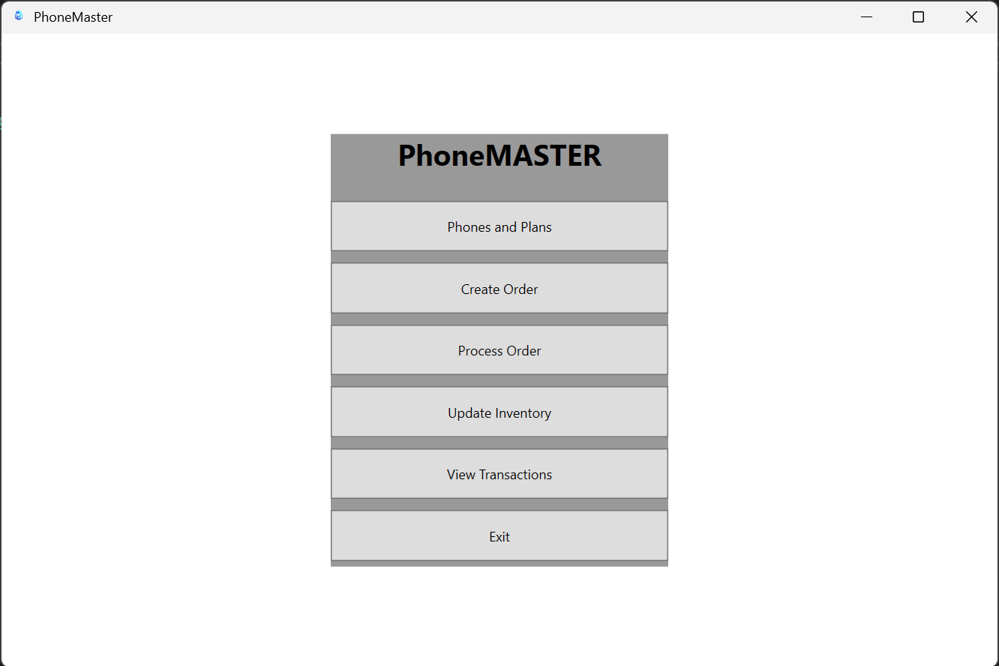
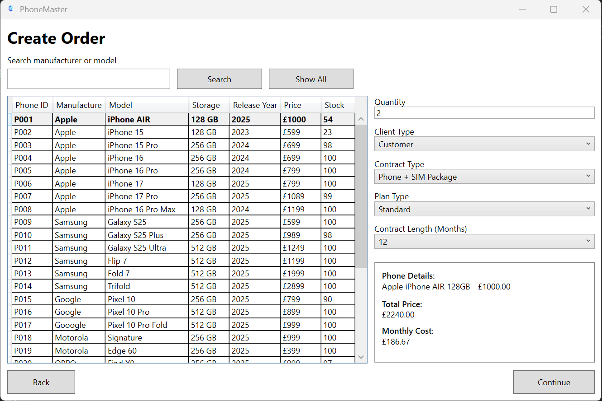
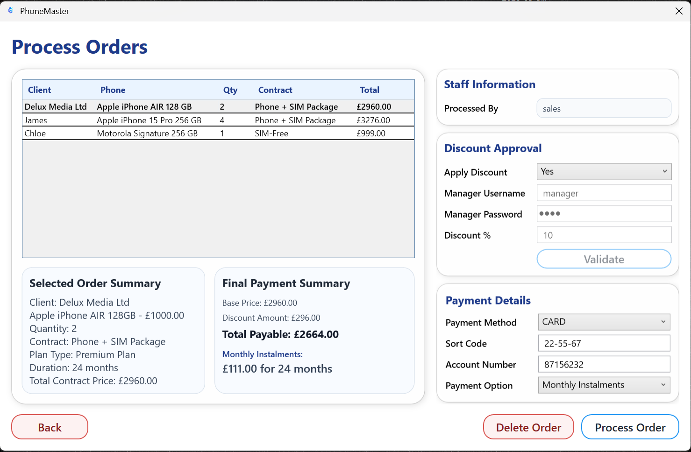
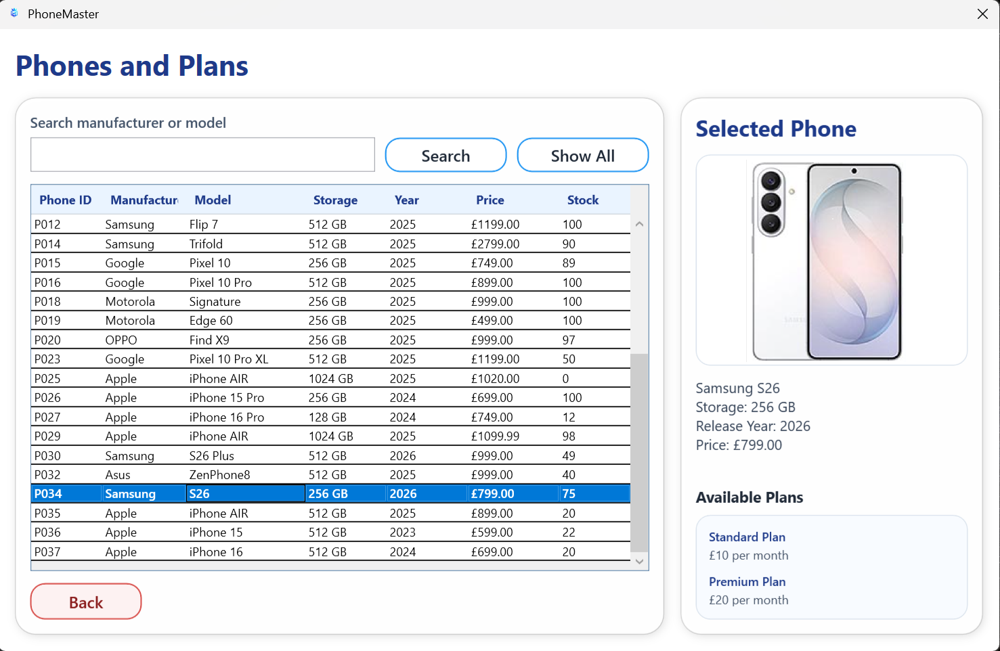
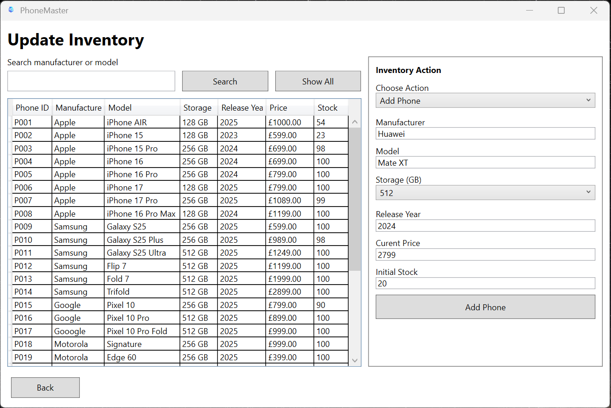
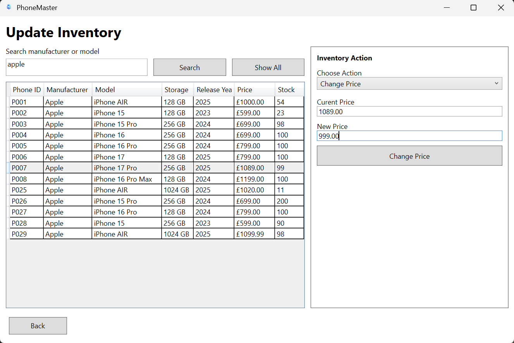
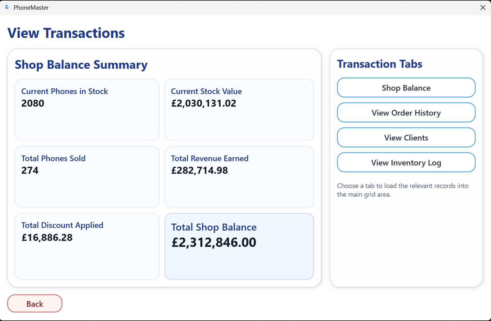
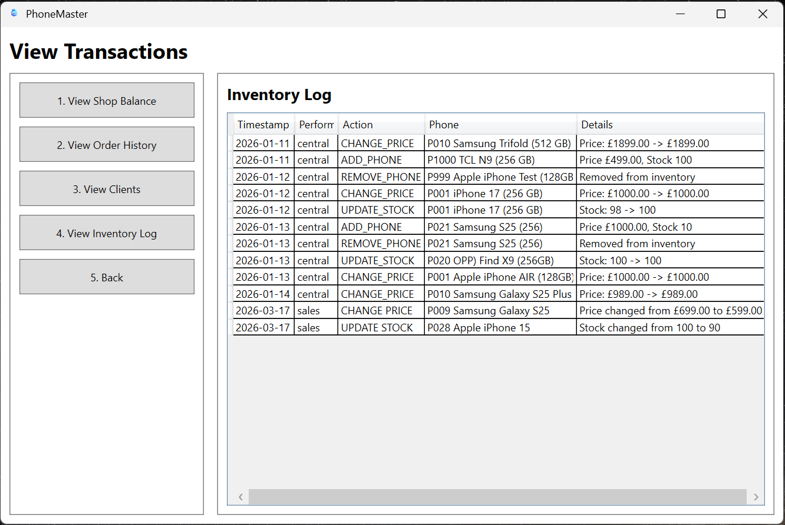
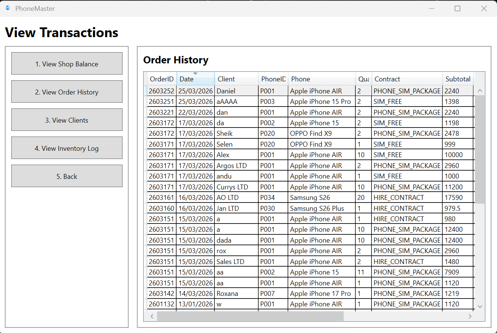

PhoneMaster - Retail Management Desktop Application

Built a desktop application in C# and WPF to simulate the workflow of a mobile phone store, including stock management, customer order creation, contract-based pricing, manager-approved discounts, payment handling, receipt generation, and transaction tracking. Applied object-oriented design principles and structured business logic across models and service classes.

 ## Features

- View available phones and stock levels
- Create customer orders
- Support for multiple contract types:
  - SIM Free
  - Phone + SIM Package
  - Hire Contract
- Process orders with optional manager-approved discounts
- Payment handling (cash/card)
- Inventory updates (Central Staff only)
- Order history and transaction tracking

 ## Technologies

- C#
- WPF (Windows Presentation Foundation)
- .NET
- Visual Studio 2022
- File-based storage (no database)

  ## Architecture

The application follows a layered structure:

- PhoneMaster.Core
  - Models (Phone, Order, Contract, Client)
  - Services (Order processing, pricing logic)

- PhoneMasterGUI
  - WPF UI (XAML + code-behind)
  - Handles user interaction and displays data

Data is stored using text files:
- phones.txt
- transactions.txt
- clients.txt
- receipts/

## Business Logic

- Discounts:
  - Maximum 20%
  - Requires manager approval

- Contract Types:
  - SIM Free: one-time payment
  - Phone + SIM: phone price + monthly plan × duration
  - Hire Contract: includes percentage of phone price + yearly plan

- Plans:
  - Standard: £10/month
  - Premium: £20/month

- Order Processing:

## How to Run

1. Open the solution in Visual Studio
2. Set `PhoneMasterGUI` as Startup Project
3. Build the solution
4. Run the application

Requirements:
- .NET installed
- Windows OS (WPF only)

## Limitations

- Uses file-based storage instead of a database
- Limited validation for user input
- No authentication system implemented

## Future Improvements

- Replace file storage with SQL database
- Implement user authentication and roles
- Add reporting and analytics
- Improve UI/UX design
- Convert to a web-based system
- Desktop-only (no web or mobile support)

## Screenshots

### Welcome Screen

### Main Menu

### Create Order

### Process Order

### Phones List

### Inventory Management - Add Phone 

### Inventory Management - Change Phone Price 

### View Transactions - Shop Balance Summary

### View Transactions - Inventory Management Log

### View Transactions - Order History

## Author

Daniel V
HND Software Development
New College Lanarkshire
  - Orders must exist before processing
  - Stock must be available
  - Payment method required before completion
